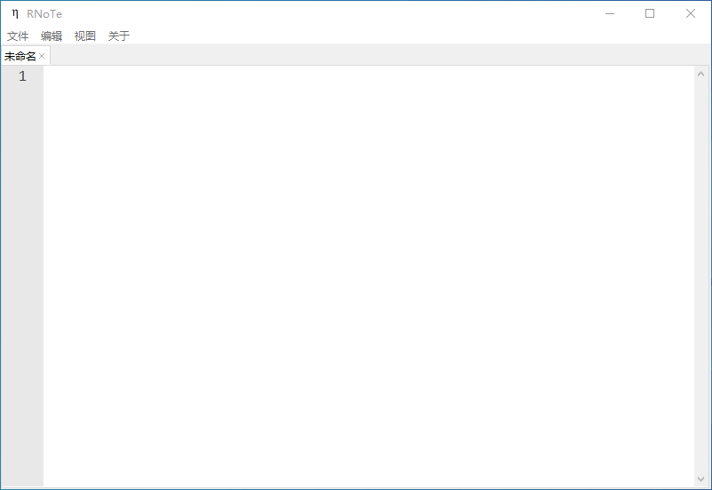

# RNoTe


简体中文 | [English](README_EN.md)

&emsp;&emsp;本项目是使用 Tkinter 开发的一个轻量快捷的文本编辑器，软件界面设计整洁，  
适合沉浸式编辑文本和写笔记。

## 预览



## 使用

&emsp;&emsp;在项目的 Realeases 中下载稳定软件版本，  
自打包按以下步骤（Pyinstaller为例）：

&emsp;&emsp;1.在项目根目录执行打包命令：

```
pyinstaller main.spec
```

&emsp;&emsp;2.从```dist/main/_internal```目录下将```data```和```lang```转移到```main```下

> ```_internal```只存在 Pyinstaller 6.0.0+

&emsp;&emsp;欢迎为此项目做出贡献，

> Bilibili：[SkyElysium](https://space.bilibili.com/1994381139?spm_id_from=333.1007.0.0)
